# AutoGenie — End-to-End Architecture

## Pipeline Overview

```
┌─────────────────────────────────────────────────────────────────────────────────────────────────┐
│                              AUTOGENIE — GENIE SPACE CREATION PIPELINE                          │
│                                                                                                 │
│   Automated creation of Databricks AI/BI Genie Spaces from Unity Catalog metadata,              │
│   query history mining, and LLM-augmented intelligence.                                         │
└─────────────────────────────────────────────────────────────────────────────────────────────────┘


 ┌──────────────────────────────────────────────────────────────────────────────────────────────┐
 │                                   CONFIGURATION LAYER                                        │
 │                                                                                              │
 │   config.yml                    .env                           prompts.yml                    │
 │   ┌──────────────────┐         ┌──────────────────┐           ┌──────────────────────┐       │
 │   │ • catalog/schema  │         │ • DATABRICKS_HOST │           │ • llm_model            │       │
 │   │ • tables[]        │         │ • DATABRICKS_TOKEN│           │ • query_generation     │       │
 │   │ • cluster_id      │         └──────────────────┘           │   system/user prompts  │       │
 │   │ • warehouse_id    │                                        │ • payload_validation   │       │
 │   │ • lookback_days   │                                        │   system/user/schema   │       │
 │   │ • confidence      │                                        └──────────────────────┘       │
 │   │ • output_path     │                                                                      │
 │   └──────────────────┘                                                                       │
 └──────────────────────┬───────────────────────────────────────────────────────────────────────┘
                        │
                        ▼
 ┌──────────────────────────────────────────────────────────────────────────────────────────────┐
 │                             SHARED UTILITIES (utils/auto_genie_utils.py)                      │
 │                                                                                              │
 │  ┌─────────────────────┐ ┌──────────────────────┐ ┌──────────────────────────────────┐      │
 │  │  Config & Env        │ │  Metadata Discovery  │ │  Relationship Discovery           │      │
 │  │  ─────────────       │ │  ──────────────────   │ │  ──────────────────────           │      │
 │  │ • load_yaml_config   │ │ • extract_table_     │ │ • discover_declared_relationships │      │
 │  │ • load_prompts       │ │   metadata           │ │ • discover_naming_pattern_        │      │
 │  │ • get_spark_session  │ │ • profile_column_    │ │   relationships                   │      │
 │  │ • load_env_config    │ │   statistics         │ │ • discover_query_pattern_         │      │
 │  └─────────────────────┘ └──────────────────────┘ │   relationships                   │      │
 │                                                    │ • merge_and_rank_relationships     │      │
 │  ┌─────────────────────┐ ┌──────────────────────┐ └──────────────────────────────────┘      │
 │  │  Business Domain     │ │  Instruction          │                                          │
 │  │  Intelligence        │ │  Generation           │ ┌──────────────────────────────────┐      │
 │  │  ─────────────       │ │  ──────────────────   │ │  SQL Expression Generation        │      │
 │  │ • detect_domain      │ │ • generate_table_    │ │  ──────────────────────           │      │
 │  │ • get_table_purpose  │ │   instructions       │ │ • generate_sql_expressions        │      │
 │  │ • classify_column_   │ │ • generate_join_     │ │   → measures                      │      │
 │  │   role               │ │   instructions       │ │   → filters                       │      │
 │  │ • generate_kpi_      │ │ • generate_business_ │ │   → dimensions                    │      │
 │  │   section            │ │   driven_instructions│ │                                    │      │
 │  │ • DOMAIN_SIGNALS     │ │ • generate_table_    │ └──────────────────────────────────┘      │
 │  │ • TABLE_PURPOSE_     │ │   detail_block       │                                          │
 │  │   PATTERNS           │ └──────────────────────┘                                          │
 │  └─────────────────────┘                                                                     │
 └──────────────────────────────────────────────────────────────────────────────────────────────┘

 ════════════════════════════════════════════════════════════════════════════════════════════════

 STAGE 1 ─ QUERY INTELLIGENCE & PATTERN MINING
 ══════════════════════════════════════════════
 scripts/01_query_intelligence.ipynb

 ┌────────────────────┐     ┌──────────────────────┐     ┌───────────────────────────┐
 │  UNITY CATALOG     │     │  SYSTEM.QUERY.HISTORY│     │  LLM (ChatDatabricks)     │
 │  ──────────────    │     │  ────────────────────│     │  ─────────────────────    │
 │  information_      │     │  SELECT queries from │     │  databricks-claude-       │
 │  schema.tables     │     │  target schema with  │     │  opus-4-6                 │
 │  information_      │     │  lookback_days       │     │                           │
 │  schema.columns    │     │  window              │     │  Generates sample SQL     │
 │                    │     │                      │     │  queries from schema      │
 └────────┬───────────┘     └──────────┬───────────┘     └─────────────┬─────────────┘
          │                            │                               │
          ▼                            ▼                               │
 ┌────────────────────┐     ┌──────────────────────┐                  │
 │  Extract Table     │     │  Extract 10K Queries │                  │
 │  Metadata          │     │  (SELECT only,       │                  │
 │  ────────────      │     │   error-free)        │                  │
 │  4 tables          │     └──────────┬───────────┘                  │
 │  52 column profiles│                │                               │
 └────────┬───────────┘                ▼                               │
          │                 ┌──────────────────────┐                  │
          │                 │  Parse SQL            │                  │
          │                 │  (sqlglot)            │                  │
          │                 │  ────────────         │                  │
          │                 │  Extract: tables,     │                  │
          │                 │  columns, aggregations│                  │
          │                 │  joins, WHERE, GROUP  │                  │
          │                 └──────────┬───────────┘                  │
          │                            │                               │
          │                            ▼                               │
          │                 ┌──────────────────────┐                  │
          │                 │  Cluster Queries      │                  │
          │                 │  (TF-IDF + DBSCAN)   │                  │
          │                 │  ────────────────     │                  │
          │                 │  16 query patterns    │                  │
          │                 │  identified           │                  │
          │                 └──────────┬───────────┘                  │
          │                            │                               │
          │                            ▼                               │
          │                 ┌──────────────────────┐                  │
          │                 │  Generate Examples    │                  │
          │                 │  from Clusters        │                  │
          │                 │  ──────────────       │                  │
          │                 │  10 history-based     │                  │
          │                 │  representative       │                  │
          │                 │  queries              │                  │
          │                 └──────────┬───────────┘                  │
          │                            │                               │
          │                            │     ┌─────────────────────────┘
          │                            │     │
          │                            │     ▼
          │                            │  ┌──────────────────────┐
          │                            │  │  LLM Query           │
          │                            │  │  Generation           │
          │                            │  │  ──────────────       │
          │                            │  │  System + User prompt │
          │                            │  │  with schema context  │
          │                            │  │  ↓                    │
          │                            │  │  20 LLM-generated     │
          │                            │  │  queries              │
          │                            │  │  ↓                    │
          │                            │  │  Scope validation     │
          │                            │  │  (in-scope tables     │
          │                            │  │   only)               │
          │                            │  │                       │
          │                            │  │  Fallback chain:      │
          │                            │  │  1. Full schema       │
          │                            │  │  2. Minimal schema    │
          │                            │  │  3. Rule-based gen    │
          │                            │  └──────────┬───────────┘
          │                            │             │
          │                            ▼             ▼
          │                 ┌──────────────────────────────────┐
          │                 │  MERGE & FINALIZE                 │
          │                 │  ─────────────────                │
          │                 │  Deduplicate + rank by source:    │
          │                 │  • History-based (priority)       │
          │                 │  • LLM-generated (fill remaining) │
          │                 │  → Final 20 sample queries        │
          │                 └──────────────────┬───────────────┘
          │                                    │
          │                                    ▼
          │                        ┌─────────────────────┐
          │                        │  example_queries.json│
          │                        │  (output artifact)   │
          │                        └─────────────────────┘
          │
          ▼
 ════════════════════════════════════════════════════════════════════════════════════════════════

 STAGE 2 ─ KNOWLEDGE STORE ASSEMBLY & VALIDATION
 ════════════════════════════════════════════════
 scripts/02_assembly_validation.ipynb

          ┌──────────────────────────────────────────────────────────────────┐
          │                    LOAD ALL PREREQUISITES                        │
          │                                                                  │
          │  ┌──────────────┐  ┌───────────────┐  ┌──────────────────────┐  │
          │  │ Table         │  │ Column         │  │ example_queries.json │  │
          │  │ Metadata      │  │ Profiles       │  │ (from Stage 1)       │  │
          │  └──────┬───────┘  └───────┬────────┘  └──────────┬──────────┘  │
          │         │                  │                       │             │
          │         ▼                  ▼                       ▼             │
          │  ┌───────────────────────────────────────────────────────────┐   │
          │  │  Generate All Instructions (via auto_genie_utils)         │   │
          │  │  ─────────────────────────────────────────────────        │   │
          │  │  • Table Instructions (descriptions, key cols, hints)     │   │
          │  │  • Join Instructions (from relationship discovery)        │   │
          │  │  • SQL Expressions (measures, filters, dimensions)        │   │
          │  │  • Business-Driven Instructions (domain, KPIs, practices) │   │
          │  └────────────────────────────┬──────────────────────────────┘   │
          │                               │                                  │
          └───────────────────────────────┼──────────────────────────────────┘
                                          │
                                          ▼
                              ┌───────────────────────┐
                              │  ASSEMBLE KNOWLEDGE    │
                              │  STORE                 │
                              │  ─────────────────     │
                              │  Genie API-compatible  │
                              │  JSON structure:       │
                              │                        │
                              │  ┌──────────────────┐  │
                              │  │ space_name        │  │
                              │  │ catalog/schema    │  │
                              │  │ warehouse_id      │  │
                              │  │ tables[]          │  │
                              │  │   columns, desc   │  │
                              │  │   key_cols, hints │  │
                              │  │ joins[]           │  │
                              │  │ sql_expressions   │  │
                              │  │   measures[]      │  │
                              │  │   filters[]       │  │
                              │  │   dimensions[]    │  │
                              │  │ example_queries[] │  │
                              │  │ global_instructions│ │
                              │  │ domain / kpis     │  │
                              │  └──────────────────┘  │
                              └───────────┬───────────┘
                                          │
                          ┌───────────────┼────────────────┐
                          │               │                │
                          ▼               ▼                ▼
              ┌───────────────┐ ┌─────────────────┐ ┌──────────────┐
              │  STRUCTURE     │ │  SQL SYNTAX      │ │  CONSISTENCY │
              │  VALIDATION    │ │  VALIDATION      │ │  CHECKS      │
              │  ────────────  │ │  ──────────────  │ │  ────────── │
              │ • Required     │ │ • Join SQL       │ │ • Table desc │
              │   fields       │ │ • Measure exprs  │ │   coverage   │
              │ • Table count  │ │ • Filter exprs   │ │ • Join       │
              │ • Join defs    │ │ • Dimension exprs│ │   completeness│
              │ • Expressions  │ │ • Example queries│ │ • Instruction│
              │ • Instructions │ │                  │ │   length     │
              │                │ │  (via sqlglot    │ │              │
              │                │ │   Databricks     │ │              │
              │                │ │   dialect)       │ │              │
              └───────┬───────┘ └────────┬────────┘ └──────┬───────┘
                      │                  │                  │
                      └──────────────────┼──────────────────┘
                                         │
                                         ▼
                              ┌────────────────────────┐
                              │  VALIDATION RESULTS     │
                              │  ─────────────────      │
                              │  ✅ PASSED → Continue   │
                              │  ❌ FAILED → Fix issues │
                              └───────────┬────────────┘
                                          │
                                          ▼
                              ┌─────────────────────────┐
                              │  knowledge_store.json    │
                              │  (output artifact)       │
                              └─────────────────────────┘

 ════════════════════════════════════════════════════════════════════════════════════════════════

 STAGE 3 ─ GENIE SPACE DEPLOYMENT
 ════════════════════════════════
 scripts/03_genie_deployment.ipynb

              ┌─────────────────────────┐
              │  knowledge_store.json    │
              │  (from Stage 2)          │
              └───────────┬─────────────┘
                          │
                          ▼
              ┌───────────────────────────────────────────────────────┐
              │  BUILD SERIALIZED SPACE (version 2)                   │
              │  ─────────────────────────────────                    │
              │                                                       │
              │  ┌─────────────────────────────────────────────────┐  │
              │  │  data_sources.tables[]                           │  │
              │  │    identifier + description                      │  │
              │  ├─────────────────────────────────────────────────┤  │
              │  │  config.sample_questions[]                       │  │
              │  │    id + question text                            │  │
              │  ├─────────────────────────────────────────────────┤  │
              │  │  instructions.text_instructions[]                │  │
              │  │    Global business context & domain instructions │  │
              │  ├─────────────────────────────────────────────────┤  │
              │  │  instructions.join_specs[]                       │  │
              │  │    left/right table identifiers + SQL condition  │  │
              │  ├─────────────────────────────────────────────────┤  │
              │  │  instructions.example_question_sqls[]            │  │
              │  │    NL question ↔ SQL answer pairs                │  │
              │  ├─────────────────────────────────────────────────┤  │
              │  │  instructions.sql_snippets                      │  │
              │  │    .measures[]    (alias + SQL aggregation)      │  │
              │  │    .filters[]     (display_name + SQL predicate) │  │
              │  │    .expressions[] (alias + SQL dimension)        │  │
              │  └─────────────────────────────────────────────────┘  │
              └───────────────────────┬───────────────────────────────┘
                                      │
                                      ▼
              ┌───────────────────────────────────────────────────────┐
              │  LLM PAYLOAD VALIDATION                               │
              │  ─────────────────────                                │
              │  ChatDatabricks validates JSON against reference       │
              │  schema. Safeguards:                                   │
              │  • Table count preserved                               │
              │  • Example count ≥ 80% of original                     │
              │  • Fallback to original on parse error                 │
              └───────────────────────┬───────────────────────────────┘
                                      │
                                      ▼
              ┌───────────────────────────────────────────────────────┐
              │  CREATE GENIE SPACE (Databricks SDK)                   │
              │  ─────────────────────────────────                    │
              │                                                       │
              │  WorkspaceClient.genie.create_space(                   │
              │      warehouse_id  = <SQL Warehouse>,                  │
              │      serialized_space = <JSON payload>,                │
              │      title         = <space_name>,                     │
              │      description   = <space_description>               │
              │  )                                                     │
              │                                                       │
              │  Fallback: if join_specs rejected by API,              │
              │  rebuild with joins embedded in text_instructions      │
              └───────────────────────┬───────────────────────────────┘
                                      │
                          ┌───────────┼────────────────┐
                          │           │                │
                          ▼           ▼                ▼
              ┌──────────────┐ ┌──────────────┐ ┌───────────────────┐
              │  VERIFY       │ │  TEST         │ │  FINALIZE          │
              │  DEPLOYMENT   │ │  CONVERSATIONS│ │  ─────────         │
              │  ────────     │ │  ─────────── │ │  Save deployment   │
              │  Read back    │ │  3 sample     │ │  summary JSON      │
              │  space config │ │  questions    │ │  with space URL,   │
              │  from API and │ │  via genie.   │ │  config counts,    │
              │  confirm all  │ │  start_       │ │  and status        │
              │  components   │ │  conversation │ │                    │
              │  deployed     │ │  _and_wait()  │ │                    │
              └──────────────┘ └──────────────┘ └───────────────────┘
                                                          │
                                                          ▼
                                              ┌─────────────────────────┐
                                              │  DEPLOYED GENIE SPACE    │
                                              │  ═══════════════════     │
                                              │                          │
                                              │  Accessible at:          │
                                              │  <workspace>/genie/      │
                                              │  rooms/<space_id>        │
                                              │                          │
                                              │  Ready for natural       │
                                              │  language querying       │
                                              │  by business users       │
                                              └─────────────────────────┘


 ════════════════════════════════════════════════════════════════════════════════════════════════

 DATA FLOW SUMMARY
 ═════════════════

   Unity Catalog ─────────────┐
   (table/column metadata)    │
                              │
   system.query.history ──────┤
   (SQL query logs)           │         ┌──────────────┐       ┌─────────────────┐
                              ├────────▶│   Stage 1     │──────▶│ example_queries │
   ChatDatabricks LLM ────────┤         │   Query       │       │ .json           │
   (query generation)         │         │   Intelligence│       └────────┬────────┘
                              │         └──────────────┘                │
   config.yml + .env ─────────┘                                         │
   prompts.yml                                                          │
                                                                        │
   Unity Catalog ─────────────┐                                         │
   (re-extracted)             │         ┌──────────────┐       ┌────────▼────────┐
                              ├────────▶│   Stage 2     │──────▶│ knowledge_store │
   auto_genie_utils.py ──────┤         │   Assembly &  │       │ .json           │
   (instruction generators)   │         │   Validation  │       └────────┬────────┘
                              │         └──────────────┘                │
   example_queries.json ──────┘                                         │
                                                                        │
   Databricks SDK ────────────┐                                         │
   (WorkspaceClient)          │         ┌──────────────┐       ┌────────▼────────┐
                              ├────────▶│   Stage 3     │──────▶│ Deployed Genie  │
   ChatDatabricks LLM ────────┤         │   Deployment  │       │ Space           │
   (payload validation)       │         └──────────────┘       │                 │
                              │                                 │ + deployment_   │
   knowledge_store.json ──────┘                                 │   summary.json  │
                                                                │ + validated_    │
                                                                │   payload.json  │
                                                                └─────────────────┘


 TECHNOLOGY STACK
 ════════════════

   ┌────────────────────┬──────────────────────────────────────────────────────┐
   │  Component          │  Technology                                          │
   ├────────────────────┼──────────────────────────────────────────────────────┤
   │  Compute            │  Databricks Connect (remote Spark)                   │
   │  Catalog            │  Unity Catalog (information_schema)                  │
   │  Query History      │  system.query.history                                │
   │  SQL Parsing        │  sqlglot (Databricks dialect)                        │
   │  ML Clustering      │  scikit-learn (TF-IDF + DBSCAN)                     │
   │  LLM               │  ChatDatabricks (databricks-claude-opus-4-6)         │
   │  LLM Framework      │  LangChain (langchain_core, databricks_langchain)   │
   │  Deployment API     │  Databricks SDK (WorkspaceClient.genie)             │
   │  SQL Warehouse      │  Databricks SQL Warehouse (for Genie runtime)       │
   │  Configuration      │  YAML (config.yml, prompts.yml) + dotenv (.env)     │
   │  Domain Intelligence│  Rule-based heuristics (DOMAIN_SIGNALS, KPI gen)    │
   └────────────────────┴──────────────────────────────────────────────────────┘
```

## Mermaid Diagram

```mermaid
flowchart TB
    subgraph CONFIG["Configuration Layer"]
        CFG["config.yml<br/>catalog, schema, tables,<br/>cluster, warehouse"]
        ENV[".env<br/>DATABRICKS_HOST<br/>DATABRICKS_TOKEN"]
        PROMPTS["prompts.yml<br/>LLM prompts for<br/>query gen & validation"]
    end

    subgraph UTILS["Shared Utilities — auto_genie_utils.py"]
        U1["Config & Environment<br/>load_yaml_config()<br/>get_spark_session()"]
        U2["Metadata Discovery<br/>extract_table_metadata()<br/>profile_column_statistics()"]
        U3["Relationship Discovery<br/>discover_declared_relationships()<br/>discover_naming_patterns()<br/>discover_query_patterns()"]
        U4["Business Domain Intel<br/>detect_domain()<br/>classify_column_role()<br/>generate_kpi_section()"]
        U5["Instruction Generation<br/>generate_table_instructions()<br/>generate_join_instructions()<br/>generate_business_driven_instructions()"]
        U6["SQL Expression Gen<br/>generate_sql_expressions()<br/>→ measures, filters, dimensions"]
    end

    subgraph SOURCES["External Data Sources"]
        UC["Unity Catalog<br/>information_schema"]
        QH["system.query.history<br/>SQL Query Logs"]
        LLM["ChatDatabricks LLM<br/>databricks-claude-opus-4-6"]
        SDK["Databricks SDK<br/>WorkspaceClient"]
    end

    subgraph S1["Stage 1 — Query Intelligence & Pattern Mining<br/>01_query_intelligence.ipynb"]
        direction TB
        S1A["Extract Table Metadata<br/>4 tables, 52 columns"] --> S1B["Profile Column Statistics<br/>cardinality, nulls, PII"]
        S1C["Extract Query History<br/>283 queries (90-day lookback)"] --> S1D["Parse SQL (sqlglot)<br/>tables, columns, aggs, joins"]
        S1D --> S1E["Cluster Queries<br/>TF-IDF + DBSCAN<br/>16 patterns identified"]
        S1E --> S1F["Generate Examples<br/>from History Clusters<br/>10 representative queries"]
        S1G["LLM Query Generation<br/>20 queries from schema<br/>with 3-tier fallback"] --> S1H["Scope Validation<br/>filter to in-scope tables"]
        S1F --> S1I["Merge & Finalize<br/>deduplicate, rank by source<br/>history-first priority"]
        S1H --> S1I
        S1I --> EQ["example_queries.json<br/>20 validated queries"]
    end

    subgraph S2["Stage 2 — Knowledge Store Assembly & Validation<br/>02_assembly_validation.ipynb"]
        direction TB
        S2A["Load Prerequisites<br/>metadata, profiles,<br/>relationships, queries"] --> S2B["Generate All Instructions<br/>table, join, SQL expressions,<br/>business-driven instructions"]
        S2B --> S2C["Assemble Knowledge Store<br/>Genie API-compatible JSON"]
        S2C --> S2D["Structure Validation<br/>required fields, counts,<br/>completeness checks"]
        S2C --> S2E["SQL Syntax Validation<br/>sqlglot parse check<br/>68/68 passed"]
        S2D --> S2F{"Validation<br/>Passed?"}
        S2E --> S2F
        S2F -->|"✅ Yes"| KS["knowledge_store.json"]
        S2F -->|"❌ No"| S2G["Fix Issues & Retry"]
        S2G --> S2C
    end

    subgraph S3["Stage 3 — Genie Space Deployment<br/>03_genie_deployment.ipynb"]
        direction TB
        S3A["Load Knowledge Store"] --> S3B["Build Serialized Space<br/>version 2 payload:<br/>tables, questions, instructions,<br/>join_specs, SQL snippets"]
        S3B --> S3C["LLM Payload Validation<br/>schema conformance check<br/>with safety guards"]
        S3C --> S3D["Create Genie Space<br/>WorkspaceClient.genie<br/>.create_space()"]
        S3D --> S3E{"API<br/>Success?"}
        S3E -->|"❌ join_specs rejected"| S3F["Fallback: embed joins<br/>in text_instructions"]
        S3F --> S3D
        S3E -->|"✅ Created"| S3G["Verify Deployed Space<br/>read back & confirm config"]
        S3G --> S3H["Test Conversations<br/>3 sample questions via<br/>genie.start_conversation()"]
        S3H --> S3I["Finalize Deployment"]
        S3I --> GENIE["Deployed Genie Space<br/>workspace/genie/rooms/&lt;id&gt;"]
        S3I --> DS["deployment_summary.json"]
    end

    CONFIG --> UTILS
    UC --> S1A
    UC --> S1C
    QH --> S1C
    LLM --> S1G
    UTILS --> S1
    EQ --> S2A
    UC --> S2A
    UTILS --> S2
    KS --> S3A
    LLM --> S3C
    SDK --> S3D
    UTILS --> S3

    style CONFIG fill:#2d3748,stroke:#4a5568,color:#e2e8f0
    style UTILS fill:#1a365d,stroke:#2b6cb0,color:#bee3f8
    style SOURCES fill:#2d3748,stroke:#4a5568,color:#e2e8f0
    style S1 fill:#1c4532,stroke:#276749,color:#c6f6d5
    style S2 fill:#44337a,stroke:#6b46c1,color:#e9d8fd
    style S3 fill:#744210,stroke:#b7791f,color:#fefcbf
    style GENIE fill:#22543d,stroke:#38a169,color:#c6f6d5
```


